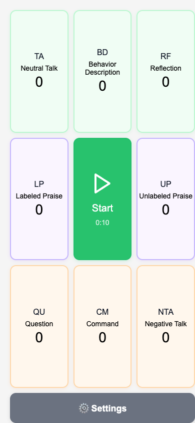

# CDI Coding Counter

| App Preview | Quick Access |
|-------------|--------------|
|  |  |
| | Scan to open: [lexler.github.io/hack_for_good](https://lexler.github.io/hack_for_good/) |

## Keyboard Shortcuts

You can use your keyboard instead of tapping:

<table>
<thead>
<tr>
<th align="center">Number Pad</th>
<th align="center">App</th>
<th align="center">QWERTY</th>
</tr>
</thead>
<tbody>
<tr>
<td align="center">
<table>
<tr><td>7</td><td>8</td><td>9</td></tr>
<tr><td>4</td><td>5</td><td>6</td></tr>
<tr><td>1</td><td>2</td><td>3</td></tr>
</table>
</td>
<td align="center">
<table>
<tr><td>TA</td><td>BD</td><td>RF</td></tr>
<tr><td>LP</td><td>↩️</td><td>UP</td></tr>
<tr><td>QU</td><td>CM</td><td>NTA</td></tr>
</table>
</td>
<td align="center">
<table>
<tr><td>Q</td><td>W</td><td>E</td></tr>
<tr><td>A</td><td>S</td><td>D</td></tr>
<tr><td>Z</td><td>X</td><td>C</td></tr>
</table>
</td>
</tr>
</tbody>
</table>

## User Guide

Read the whole [user guide here](./docs/user-guide.md) 

---

*Developer? See [contribute.md](contribute.md) for technical details and development setup.*